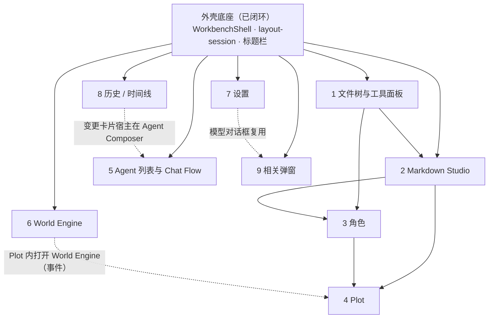

# 未迁视图迁移清单（切片 6）

- 状态：调查完成（只读取证，不含任何实现改动）。
- 工作区：`.worktree/w00003-neurobook-ui-foundation-migration`，分支 `refactor/w00003-nb-ui-adoption`。
- 调查基线 revision：`7348e7e7`（`docs(work): open the view migration inventory task`）；工作区另有用户 dirty 文件 `app/utils/workbench/descriptors{,.test}.ts`（未触碰）。
- 命令与退出码、取证方式、未运行项见 [walkthroughs/implementation.md](tasks/t54-view-migration-inventory/walkthroughs/implementation.md)。

## 0. 口径与证据分级

**路径口径**：`app/...` = `packages/neuro-book/app/...`；`pkgdocs/...` = `packages/neuro-book/docs/...`；`docs/...` = 仓库根 `docs/...`。所有 `文件:行` 都是该 revision 上可复核的真实行号。

**六类证据（每项逐条给出）**：
1. 源码调用点（主页面/外壳/组件中的真实引用与当前 authority）。
2. 同名文档（`app/components/**/*.md`）的成熟度原文，以及与实现的矛盾点。
3. Component Lab fixture 覆盖（`app/component-lab/fixtures/index.ts` 的 `component`/场景 id）。
4. 主页面入口（`SHELL_LEAF_IDS`、activity 叶、标题栏菜单、书架/资产入口）与是否可达。
5. 真实运行观察（**只读**取自开发者运行中的 3001，或既有真机截图）。
6. 状态归属判定（user/project × local/shared）及 `docs/specs/storage/` 依据。

**本文件的边界**：只登记事实与建议切片，不实现迁移、不改产品代码、不把「计划里写过」当证据。命令系统与桌面多窗口**单列**（第 4 章），不混入视图搬迁。

**证据标识**（下文引用）：
- `O1` 3001 只读 DOM 观察（2026-09-16，本次；`http://localhost:3001/` 书架态，无项目打开）：外壳叶只有 `titlebar`(1440×36)、`activity`(60×864)、`editor`(1380×864) 三个，`[data-leaf="left"]`/`[data-leaf="right"]` 计数均为 0；`--workbench-titlebar-height: 36px`、`--workbench-activity-gutter: 6px`；activity 叶 10 个按钮中第 0（home）、第 8（account）、第 9（settings）可用，第 1–7 全部 `disabled=true`；标题栏文本 `NeuroBook File Edit View Help 书架 搜索`（搜索按钮 `aria-disabled=true`）。截图：`tasks/t54-view-migration-inventory/probe-3001-shell.png`。**未与页面交互、未打开 Project、未启动任何 dev server。**
- `O2` 既有真机截图 `%TEMP%/nbook-t50-accept/shots/combo1-nbook-light-1440.png`（切片 5 在隔离宿主 3511 上打开 Project 后的主页面）：左叶显示占位文案、editor 叶显示「编辑器：Markdown Studio / 欢迎页（后续阶段迁入）」、右叶显示「右栏容器：Agent Chat Surface（后续阶段迁入）」；File 菜单只有「打开文件」「设置」两项。
- `O3` 3001 隔离根磁盘观察（只读）：`%TEMP%/nb-3001-8KseHT/state/workspace/.nbook/storage/<身份域>/<主体>/local/<客户端>/` 下有 `workbench.layout/records/surface-sizes~idle.json`=`{"leftPanelWidth":340,"agentPanelWidth":400}`、`surface-sizes~user-assets.json`、`shelf-mode.json`=`"grid"`，并有多个 `workbench.migration/records/completion.json`；另有一个客户端分区记录 `surface-sizes~idle`=`{"leftPanelWidth":355.60513664614405,"agentPanelWidth":527.5473517757064}`（真实拖拽结果）。项目侧 `xin-xiao-shuo/.nbook/storage/` **为空**（该项目尚无 project/local 记录）。
- `O4` 规格/提案原文（`docs/specs/**`、`pkgdocs/proposals/**`）。

**归属判定的公共依据**（后文只写行号）：
- `docs/specs/storage/persistence.md:94-101`「数据归属与首批消费者」表；
- `docs/specs/storage/persistence.md:22`（命令系统、桌面多窗口另行设计）、`:77`（local 按客户端隔离）；
- `docs/specs/storage/boundaries.md:103`（组件不得新增裸 `localStorage`/`sessionStorage`）、`:121`（主工作台与 World Engine 尺寸归 project/local）；
- `pkgdocs/proposals/workbench-view-host.md:179-196`（状态分层与键）、`:210-217`（迁移前需分清的状态）、`:243-252`（迁移顺序与删除门禁）；
- `docs/specs/ui/workbench-shell.md:83-95`（布局状态四类 + 排除项）、`:118`（逐项删除条件）、`:52`（「现有入口全部可用」验收）、`:63`（搜索与统一命令系统未实现）。

## 1. 总表

「当前状态」取值：**未重构**（组件在仓库里、页面不挂载）/ **Lab-ready 待接入**（有同名文档 + fixture + 受控视图，只差产品宿主）/ **部分接入**（有真实入口或部分链路在跑）/ **已闭环**（入口 + authority + 迁移都完成）。

| # | 视图 | owner（组件） | 当前状态 | 关键依赖 | 状态归属（目标） | 主页面可达性 | 规模 |
|---|---|---|---|---|---|---|---|
| — | 外壳底座（基线） | `workbench/**`、`common/DesktopTitleBar*` | **已闭环** | — | project/local + user/local（见 2.1） | 可达（O1/O2） | 8 `.vue` / 2141 行 + chrome 1141 行 |
| 1 | 文件树与工具面板 | `novel-ide/workspace/**`、`NovelIdeToolPanel.vue` | **未重构** | 外壳左叶、文件 authority | 尺寸 project/local（已实现）；展开项 user/local；选中/标签按 Project 分区 | 入口可点但**无内容**（O1/O2） | 14 文件 / 5021 行 + ToolPanel 483 行 |
| 2 | Markdown Studio | `markdown-studio/**` | **未重构** | 1（打开文件链路） | 正文=领域；编辑偏好 user/local | **不可达**（占位块） | 31 文件 / 8207 行 |
| 3 | 角色 | `workspace/WorkspaceCharacter*`、Lorebook/Location/Rule | **未重构** | 1、2（Dialog 触发来自编辑器） | 数据=领域；选中按 Project；面板记忆 user/local | **不可达**（入口函数无调用方） | 5 `.vue` / 2149 行 |
| 4 | Plot（剧本工作台） | `plot/**` | **未重构** | 1、2 | 数据=领域；侧栏尺寸 project/local（新建） | **不可达**（`openPlotWorkbench` 无调用方） | 32 文件 / 10494 行 |
| 5 | Agent 列表与 Chat Flow | `agent/**`、`jobs/**` | **未重构** | 外壳右叶、session authority | Session/Job=领域；宽度 project/local；开合内存 | 右叶占位；trace 例外可达 | 96 文件 / 26115 行 |
| 6 | World Engine | `world-engine/**` | **部分接入**（Dialog 已可达，尺寸未归属、legacy 件未删） | 外壳尺寸记录、Project 上下文 | 内部尺寸 project/local；对象记忆 project/local | **可达**（activity `world` → Dialog） | 23 文件 / 8774 行 |
| 7 | 设置 | `settings/**` + `NovelIdeSettingsDialog.vue` | **部分接入**（10/10 区段真实接线；窗口尺寸仍裸 localStorage；`RolesSettingsView` 未挂） | 外壳浮层位置 | 值=Config；窗口尺寸 user/local | **可达**（activity + File 菜单） | 33 `.vue` / 5296 行 + 宿主 982 行 |
| 8 | 历史 / 时间线 | `history/WorkspaceHistoryInboxDialog.vue` | **部分接入**（收件箱可达；单文件时间线未做） | 外壳浮层、history.sqlite | 数据=领域；视图偏好 user/local | **可达**（activity `history`） | 1 文件 / 210 行（+ 复用件 383/756 行） |
| 9 | 相关弹窗 | `project-picker/**`、`profile/**`、`ai/**`、`rag/**`、`NovelIdeProfileDialog`/`AccountMenu` | **部分接入**（书架族闭环；Profile 工作台入口缺失；RAG 无宿主；Jobs 有意不挂） | 外壳叶/浮层 | 开合=内存；窗口尺寸 user/local；书架模式 user/local（已实现） | 书架/账号可达；Profile 工作台、RAG 不可达 | 10 `.vue` / 1899 行 + 宿主级 4 组件 1716 行 |
| C | 命令系统设计（单列） | — | 未开始 | 标题栏固定 IA 已先行 | 不属 Storage 能力 | 搜索入口按未实现呈现 | — |
| D | 桌面多窗口（单列） | — | 未开始 | bridge 能力 | 不属首期 Storage | 浏览器档已可用 | — |

**两个跨行事实**（对全部未迁视图成立）：
- 239 个 `app/components/**/*.vue` 中只有 **39 个有同名 `.md`**（`app/components/**/*.md` 计数），且全部落在 `common/`、`project-picker/`、`settings/`、`workbench/` 四个目录；`markdown-studio/`、`agent/`、`workspace/`、`plot/`、`world-engine/`、`history/`、`jobs/`、`profile/`、`rag/`、`ai/` **零文档**。按 `app/component-lab/component-index.ts:62`（扫 `../components/**/*.md`）与 `:118-124`（缺同名 `.vue` 或缺失即跳过），**无文档组件连 Lab 索引都进不去**，fixture 也无法按「与组件文档同名」（`app/component-lab/fixtures/index.ts:20-26`）对齐。
- Lab fixture 共 42 条 `component` 登记（`fixtures/index.ts:35-614`），实际覆盖：Lab 零件 7 条（`CollapsibleSidePanel`/`ViewportCanvas`/`MarkdownView`/`EventLogPanel`/`HighlightBox`/`JsonViewer`/`SurfaceTierDemo`）、标题栏 1 条、agent-profile 设置 9 条、设置区段 11 条、模型对话框 3 条、书架 8 条、工作台部件 3 条（合计 42）。**文件树、角色、Plot、World Engine、Agent Chat/会话/Jobs/Trace、历史、Markdown Studio、Profile、RAG 全部零覆盖。**

## 2. 逐项小节

### 2.0 基线：已经真实接入的部分（供对比，不是待办）

**① 源码调用**：主页面模板 `app/pages/index.vue:2588-2642` 是 `WorkbenchShell`，叶为 `#titlebar`(:2589 `DesktopTitleBar`)、`#activity`(:2595-2615 `NovelIdeActivityBar`)、`#left`(:2616-2623)、`#editor`(:2624-2634)、`#right`(:2635-2641)。叶的显隐由页面事实驱动：`index.vue:269-272` `shell.setLeafVisible("left"/"right", !pickerActive)`。

**② 同名文档**：`app/components/workbench/WorkbenchContainerSurface.md`、`WorkbenchPanelSurface.md`、`WorkbenchStatusBar.md`、`WorkbenchContainerSection.md`、`app/components/common/DesktopTitleBarChrome.md` 存在且与实际实现一致（切片 5 收口时更新）。

**③ Lab fixture**：`WorkbenchContainerSurface`(:537)、`WorkbenchPanelSurface`(:564)、`WorkbenchStatusBar`(:590)、`DesktopTitleBarChrome`(:119) 均有场景（含「浏览器（无桌面能力）」「编辑动作（焦点不在可编辑处）」等）。

**④ 主页面入口**：标题栏菜单为固定四组 IA（`app/utils/workbench-chrome.ts:253-290`：File `file.open`/`file.settings`/`file.quit`，Edit 六条，View `view.reload` + 桌面缩放，Help 两条）；activity 项工厂 `workbench-chrome.ts:63-85`（`home`/`files`/`characters`/`plot`/`world`/`trace`/`history`/`agent-panel`/`account`/`settings`）。

**⑤ 真实运行观察**：O1（书架态三叶 + 禁用矩阵）、O2（Project 态三叶占位）、O3（user/local 记录已落盘）、`storage-implementation-plan.md` 记录 t48 真机 8/8 场景与 t50 四主题×两尺寸读数（既有证据，不作为本次新观察）。

**⑥ 状态归属**：主工作台左右尺寸 project/local（`persistence.md:95`），未开项目/用户资产 user/local（`:96`），书架显示模式 user/local（`:97`）——均已实现：`app/utils/workbench/layout-session.ts:1-16`（两条记录路径）、`shared/storage/workbench-state.ts:91-121`（user/local 定义）、`shared/storage/workbench-shell-layout.ts:26`（project/local 的 `layout` 键）、服务端注册 `server/plugins/storage-definitions.ts` → `server/storage/product-definitions.ts:44-56`。落盘证据 O3。

### 2.1 文件树与工具面板

**owner / 当前状态 / 依赖**：`app/components/novel-ide/workspace/**` 与 `NovelIdeToolPanel.vue`｜**未重构**｜依赖外壳左叶（已就绪）与 `/api/workspace-files/*` authority（不变）。

**① 源码调用**：`NovelIdeToolPanel.vue:435/437/439` 是 files/characters/plot 三槽位的宿主；`app/pages/index.vue:12`（`NovelIdeToolPanel`）与 `:16`（`WorkspaceFilePanel`）**只 import、模板零标签**（全 app 搜 `<NovelIdeToolPanel` 无命中）；左叶当前是容器占位：`index.vue:2620-2622`（`WorkbenchContainerSurface` + 「左栏容器：工具面板 / 文件树（后续阶段迁入）」）。文件树自身：`WorkspaceFilePanel.vue:661-672` 挂 `WorkspaceFileTree`，`:675/684/693` 分派三种明细面板，`:712` 创建弹窗；数据全经 Pinia store（`app/stores/novel-ide.ts:204` `workspaceTree`、`:295` `selectedFileNode`）→ `/api/workspace-files/*`（`novel-ide.ts:705/756/780/884/1077/1093/1109/1124/1195`）+ SSE（`app/composables/useWorkspaceFileEvents.ts:17`）。搜索是纯客户端过滤（`WorkspaceFilePanel.vue:59-74`），无服务端搜索路由。

**② 同名文档**：`app/components/novel-ide/workspace/` 14 个文件**零 `.md`**、零 `.test.ts`；`app/components/novel-ide/` 根目录也无任何 `.md`。现有文档只写到**迁移前形态**：`docs/research/vscode/12-workbench-view-host-refactor.md:31`「`files`｜`NovelIdeToolPanel` 内 `WorkspaceFilePanel`｜View，位于固定 Tool Container｜适合第一批 descriptor→container→view 迁移」、`:199`（ToolPanel 持有固定槽位与 resize）——与当前「左叶占位、宿主未挂载」矛盾。另：`abandonedForm` 说明两者共存已拍板——`.agents/works/w00003-neurobook-ui-foundation-migration/tasks/t05-component-lab/README.md:42,44`（nb-ui `FileTree` 与 `WorkspaceFileTree` 形态接近但不构成替换，开发者已拍板共存）。

**③ Lab fixture**：**无**（`fixtures/index.ts` 42 条 `component` 无一命中 workspace/ToolPanel；`fixtures/*.vue` 36 个无对应文件）。结构性原因见第 1 章跨行事实。注意 `WorkspaceFilePanel` 若将来加文档，其 localStorage 写入（`WorkspaceFilePanel.vue:598/619`）会按能力标签被判 `mountable:false`（`app/component-lab/component-index.ts:88-101`）。

**④ 主页面入口**：activity `files` 项存在（`workbench-chrome.ts:71` `{id:"files", disabled: projectDisabled}`），点击走 `index.vue:2605` `@open-tab="handleSidebarToggle"` → `index.vue:1710-1720` → `toggleLeftTab`（改 `activeLeftTab`）→ 只影响图标高亮（`index.vue:499` `displaySidebarActiveTab`），**左叶不渲染任何文件树**。书架态下该项禁用（O1 第 1 个 disabled）。

**⑤ 真实运行观察**：O1（书架态 activity `files` 按钮 `disabled=true`）、O2（Project 态左叶仍是占位文案）。3001 上未做任何点击，未打开 Project。

**⑥ 状态归属判定**：
- 左/右栏尺寸：**project/local**，未开项目与用户资产为 **user/local**（`persistence.md:95-96`）；依据 `boundaries.md:121`与 `persistence.md:94-101` 表；**已实现**（`layout-session.ts`，O3 落盘）。
- 文件树展开项：**user/local**（`persistence.md:98`「视图排序、位置、显式隐藏偏好」）。现状违规：`nbook.workspaceFilePanel.expandedPaths` 裸 localStorage（`WorkspaceFilePanel.vue:44/54/598/619`），违反 `boundaries.md:103`，迁移时须并入宿主记录。
  **2026-09-16 落地**：已并入 `workbench.files`/`expanded-paths`（user/local、`records: "single"`、schemaVersion 1、默认 `{paths: []}`；定义在 `shared/storage/workbench-files.ts`，只追加到 `server/storage/product-definitions.ts` 的唯一清单）。组件不再读写 `localStorage`；旧键按「读旧键 → 记录缺失时条件初始化 → 回读一致 → 删除旧键」一次性迁移，记录已有值时不被旧键覆盖。见 [t55 实施记录](tasks/t55-files-view-migration/walkthroughs/implementation.md)。
- 打开的标签/活动文件：**按 Project 分区的编辑器恢复态**（`workbench-view-host.md:210`、`persistence.md:101` 领域 Store 排除项）；现状在 sessionStorage `novel.ide.session`（`novel-ide.ts:1948-1956`）。
- 文件内容：领域数据，仍走 `/api/workspace-files/*`，**不进 Storage**。

**真实功能缺口**：验收旅程 `docs/testing/manual-eval/journeys/workspace-tour.md`「文件树骨架」当前必然失败（左叶无内容）。
**2026-09-16 落地**：左叶已渲染真实文件树（`nbook.files` 走 L1 注册路径挂进 `nbook.tools` 容器），「文件树骨架」可得；「打开文件」仍不可通过——编辑器叶还没迁入（双击打开会在文件面板给出可见提示条，不静默）。

**建议切片**：`files` 视图接入（左容器 + descriptor/registry 的 L1 内置注册路径同批，`workbench-view-host.md:229,247`），展开项一并从裸 localStorage 迁到 user/local；文件内容 authority 不动。

**旧实现删除条件**（除公共门禁外）：`index.vue:12/:16` 未用 import 删除；`NovelIdeToolPanel.vue` 的 files 槽位退役（角色/情节未迁完前保留其余槽位同理）；`nbook.workspaceFilePanel.expandedPaths` 键在记录迁入且回读验证后删除。
**2026-09-16 状态**：`index.vue:12/:16` 两个 import 已删；`NovelIdeToolPanel.vue` 已无任何 importer（它的 files 槽位因此成为死代码，随角色/情节迁移一并退役——组件本体按本 Task 范围保留）；裸键由运行时迁移在回读验证后删除（两种情形都在真实浏览器验证过）。

### 2.2 Markdown Studio

**owner / 当前状态 / 依赖**：`app/components/markdown-studio/**`（含 `common/form/StructuredTextEditor.vue` 旁路宿主）｜**未重构**｜依赖 2.1 的打开文件链路；正文 authority 不变。

**① 源码调用**：唯一产品宿主 `MarkdownStudioWorkbench.vue`（233 行）在 `app/pages/index.vue:6` 被 import，**模板零渲染**；editor 叶当前是占位块 `index.vue:2627-2633`（文案「编辑器：Markdown Studio / 欢迎页（后续阶段迁入）」，见 O2）。组件族：`MarkdownStudio.vue:84-85/121`（`ClientOnly` + TipTap / Monaco 双视图）、`TipTapMarkdownEditor.vue:2-3`（`@tiptap/vue-3`）、`MarkdownSourceEditor.vue:2-3`（Monaco）；旁路宿主 `app/components/common/form/StructuredTextEditor.vue:4-5` 复用同一内核（被 plot 与 profile-template-editor 引用）。正文 authority 在 store：`novel-ide.ts:780`（`/api/workspace-files/read`）、`:884`（`PUT /write`）。

**② 同名文档**：无（`markdown-studio/**` 零 `.md`；`common/form/` 也零 `.md`）。外部文档却按「已上线」写：`vitepress/locales/zh-Hans/core/markdown-studio.md:1-5`（正文与设定的主编辑区、富文本/源码双模式）；`docs/testing/manual-eval/journeys/workspace-tour.md:29-32`（「在文件树打开文件 → Markdown Studio 显示文件内容」列为 P1 通过判据）。与代码现状**矛盾**（页面不渲染）。唯一与代码一致的口径是页内注释 `index.vue:2582-2585`（业务组件暂不挂载）。

**③ Lab fixture**：无。Lab 唯一 Markdown 条目是 `MarkdownView`（`fixtures/index.ts:55-63`，4 场景），其实现是 Lab 自己的文档渲染器（`app/component-lab/MarkdownView.vue:3-4` `marked` + `DOMPurify`，`:11` 自述「独立实例」），**不是**产品 TipTap 编辑器。

**④ 主页面入口**：无入口。`index.vue:6` 之外全 app 无引用；editor 叶只有 `ProjectPickerScreen`（书架态）或占位块两个分支（`index.vue:2626-2633`）。

**⑤ 真实运行观察**：O1（书架态 editor 叶是书架）、O2（Project 态 editor 叶是占位文案）。

**⑥ 状态归属判定**：
- 正文/草稿/未保存内容：**领域 Store**，不进任何 Storage（`persistence.md:101`；`workbench-view-host.md:177-196` 排除项）。现状 = 文件 API + sessionStorage 缓冲（`novel-ide.ts:379-393`、`:1948-1956`）。
- 编辑器展示偏好（`viewMode`/`markdownEditorPreferences`/`monacoEditorPreferences`）：属**视图自身记忆**，目标 **user/local**（`persistence.md:98`；`docs/specs/ui/workbench-shell.md:88-91` 状态表第 4/5 行）。现状在 `novel.ide.local`（`novel-ide.ts:1978-1980`，仍是旧桶 writer，需在旧键迁移时评估）。
- 编辑器标签/缓冲：按 Project 分区（同 2.1）。

**真实功能缺口**：写作链路整体不可用（`workspace-tour.md` 的「打开文件」「双模式切换」「编辑保存」三项；`chapter-writing.md` 全篇依赖正文落盘）。

**建议切片**：编辑器叶接入（Studio Workbench + 标签条 + 保存链路），与 2.1 同批或紧随（打开文件依赖文件树）；编辑器偏好不阻塞，随旧桶退役另行评估。

**旧实现删除条件**：`index.vue:6` 未用 import 与 editor 占位块（`index.vue:2627-2633`）删除；`MarkdownStudioWorkbench` 成为唯一宿主后，删除页面对 studio 的旧 resize/布局读取残留（`storage-consumer-source-map.md` 已登记）；`novel.ide.local` 三个编辑偏好字段在迁移完成且回读验证后退出。

### 2.3 角色（角色面板 / 世界观条目）

**owner / 当前状态 / 依赖**：`workspace/WorkspaceCharacterPanel.vue`、`WorkspaceCharacterDetailPanel.vue`、`WorkspaceLorebookDetailPanel.vue`、`WorkspaceLocationProfileDialog.vue`、`WorkspaceRuleProfileDialog.vue`｜**未重构**｜依赖 2.1（左容器）与 2.2（Profile Dialog 的触发事件来源）。

**① 源码调用**：列表 `WorkspaceCharacterPanel.vue:30-34`（按 `entryType === "character"` 过滤 `workspaceTree`）、`:23/:35-52` 本地搜索、`:675-683` 内嵌明细；明细 `WorkspaceCharacterDetailPanel.vue`（745 行，`:107` `store.saveCurrentFile()`）、`WorkspaceLorebookDetailPanel.vue:135`、`WorkspaceLocationProfileDialog.vue:104`、`WorkspaceRuleProfileDialog.vue:102`。三个 Profile Dialog 在页面级渲染（`index.vue:2655-2677`，位于 `</WorkbenchShell>`(:2642) 之后），但其开关 `openFrontmatterProfile()`（`index.vue:2159-2161`）**全 app 无调用方**；生产该事件的 `MarkdownStudioWorkbench`/`MarkdownStudio`/`TipTapMarkdownEditor` 链路（`MarkdownStudioWorkbench.vue:61`）因宿主未挂载同样断链。数据 = lorebook markdown + frontmatter，读写走 `/api/workspace-files/{read,write,tree,stat}`。

**② 同名文档**：无（`workspace/` 零 `.md`）。相关提案仍是 reviewing：`pkgdocs/proposals/character-workbench.md:3,5`（「当前 Character 与 Low-code Form 已有实现和零散字段合同，但角色导航、搜索、编辑器、关系分组、失败语义和持久化尚未形成可重建当前行为的完整规范」）。`docs/research/vscode/12-workbench-view-host-refactor.md:32` 把 characters 描述为「位于固定 Tool Container 的 View」，与当前 ToolPanel 未挂载矛盾。

**③ Lab fixture**：无。

**④ 主页面入口**：activity `characters`（`workbench-chrome.ts:72`）在书架态禁用、Project 态可点，但左叶无内容（同 2.1）；三个 Dialog 无触发。

**⑤ 真实运行观察**：O1（`characters` 在第 2 个位置 `disabled=true`）、O2（左叶占位）。Dialog 未在真机触发过（本次未交互）。

**⑥ 状态归属判定**：
- 角色/条目数据：**领域**（Project 文件），不进 Storage（`persistence.md:101`）。
- 选中角色/条目（`selectedCharacterId`/`selectedLorebookEntryId`）：需要恢复时归 **Project Storage**（`workbench-view-host.md:214`）。现状是死状态：仅 `novel-ide.ts:201-202` 定义、`:347-348` 清空、`:1952-1953` persist pick，**无消费方**；真实选中事实由 `activeWorkspaceFile`（`:211`）承载。
- 面板展开/筛选：**user/local**（`persistence.md:98`）。

**真实功能缺口**：角色面板与三个 Profile 弹窗均不可达（上游是 2.1/2.2 的断链）。

**建议切片**：`characters` 视图接入（提案阶段 3）——同时把 `openFrontmatterProfile` 接到编辑器事件；选中状态按 Project 记录或明确留内存（二选一需在切片内定）。

**旧实现删除条件**：死状态 `selectedCharacterId`/`selectedLorebookEntryId` 与新入口并存期结束后删除；`NovelIdeToolPanel.vue:437` 槽位退役；三个 Dialog 的触发从「无调用方」变为唯一新路径后，删除旧开关分支。

### 2.4 Plot（剧本工作台）

**owner / 当前状态 / 依赖**：`app/components/novel-ide/plot/**`｜**未重构**｜依赖 2.1（左容器）与 2.2（章节/线程编辑复用编辑器内核）；数据 authority 不变。

**① 源码调用**：侧栏视图唯一挂点在 `NovelIdeToolPanel.vue:439`（宿主未挂载）；工作台是独立全屏 Dialog `plot/workbench/PlotWorkbenchDialog.vue`，由 `NovelPlotPanel.vue:1854-1882` 挂载，入口按钮 `NovelPlotPanel.vue:1772-1776`（`data-testid="plot-panel-workbench-entry"`）。页面侧 `index.vue:1881-1896` `openPlotWorkbench` **全仓无调用方**；activity `plot` 项只走 `@open-tab`（`NovelIdeActivityBar.vue:114` → `index.vue:2605/1710`）改左标签。数据 = `/api/projects/plot/*`（`NovelPlotPanel.vue:699/778/864/891/910/1243/1278/1349/1421/1501/1519/1541/1633` 等）+ 规划层 typed client（`plot/planning/plot-planning-api.ts:25-80`，`:13-15` 自述存量调用点仍是裸 `$fetch`）。

**② 同名文档**：无（`plot/**` 零 `.md`）。相关原文：`assets/reference/plot/frontend.md:29-31`「剧情模块必须成为主工作区，不是附属弹窗……不应只塞进一个窄侧栏」——与现状（只挂在未挂载的 ToolPanel 里 + 全屏 Dialog）矛盾；`assets/reference/plot/system.md:178`（Plot Workbench 通过显式 UI 事件关闭自身并打开真实 World Engine Workbench）与代码一致（`NovelPlotPanel.vue:1227-1230`）。提案排序：`workbench-view-host.md:249-250`（阶段 4，Plot 左侧 View 与专用 Dialog 分开）。

**③ Lab fixture**：无。

**④ 主页面入口**：activity `plot`（`workbench-chrome.ts:73`）书架态禁用、Project 态可点但无内容；标题栏菜单无 plot 项（`workbench-chrome.ts:253-290` 固定四组）。

**⑤ 真实运行观察**：O1（`plot` 在第 3 个位置 `disabled=true`）、O2（无相关渲染）。工作台 Dialog 未在真机打开（本次未交互）。

**⑥ 状态归属判定**：
- Plot 数据（acts/chapters/threads/scenes/promises/decisions）：**领域**（plot API + 项目内存储），不进 Storage（`persistence.md:101`）。
- 侧栏/工作台尺寸：若迁入主外壳，属**主工作台几何 → project/local**（`persistence.md:95`）。现状**无尺寸状态**：宽度硬编码（`PlotWorkbenchSidebar.vue:144` `w-[292px]`、`PlotWorkbenchInspector.vue:278` `w-[380px]`、`PlotThreadPanelShell.vue:39` `w-[340px]`），`plot/workbench/plot-workbench.types.ts`（9 行）无尺寸字段——即"新建归属"，无旧值可迁。
- 工作台 tab / planning focus / 选中线程与场景：现状内存 only（`novel-ide.ts:229-233` 定义，`pick` 不含；`:199-203` 同）→ 目标按**视图记忆**，若需跨标签共享则 **project/local**，否则内存（`persistence.md:98/100`）。切片内需明确。

**真实功能缺口**：Plot 侧栏与工作台整体不可达（`chapter-writing.md` 的「第二章检查第一章状态与 Plot」依赖它）。

**建议切片**：`plot` 视图接入（阶段 4），与 `characters` 共享左容器；工作台按提案拆为「左侧 View + 专用 Dialog command」，不合并几何模型。

**旧实现删除条件**：`NovelIdeToolPanel.vue:439` 槽位退役；`index.vue:1881-1896` 的无调用方 `openPlotWorkbench` 在接到唯一入口（或删除）后清理；硬编码宽度在进入外壳叶后由 `layout.ts` 统一约束（`ui.nested-grid`）。

### 2.5 Agent 列表与 Chat Flow

**owner / 当前状态 / 依赖**：`app/components/novel-ide/agent/**` 与 `jobs/**`｜**未重构**｜仅依赖外壳右叶（`SHELL_RIGHT_CONTAINER` 已就绪）；Session/Job/Trace authority 不变。

**① 源码调用**：`agent/**` 94 文件 25763 行（含 26 个测试 / 5820 行）+ `jobs/**` 2 文件 352 行。页面侧 `index.vue:7-8` 只 import `AgentChatSurface`/`AgentModeSessionSidebar`，`:224` `agentSurfaceRef` **无模板 ref 绑定**（恒 `null`），`:433-441` 的派生 computed 与 `:1610-1698` 的全部交互函数（`showAgentSession`/`toggleAgentPanel`/`createAgentModeSession`/…）**无触发**；右叶是占位块 `index.vue:2635-2641`。Surface 内部真实挂载点（将来挂 surface 即生效）：`AgentChatSurface.vue:4312`（ChatFlow）、`:4354`（Composer）、`:4424`（SessionDialog）、`:4445`（TreeDialog）、`:4455`（ContextInspector）。Jobs：`AgentJobsDialog.vue` **全仓无宿主**，且被测试反向锁定（`app/composables/agent-jobs-wiring.test.ts:22` `expect(indexPage).not.toContain("<AgentJobsDialog")`）——「有意不挂」而非回归。Trace：`AgentTraceViewerDialog` 是唯一还在渲染的 agent 视图（`index.vue:2646`，`v-if="projectSurfaceActive"`，在壳外浮层区）。通信面全在 `app/composables/useAgentSessionApi.ts:63-203`（列表/创建/恢复/历史/systemPrompt/invocations/abort/commands/tree/attachments/relations + SSE `/events`）与 `useAgentJobsFeed.ts:385-397`、`useAgentTraceApi.ts:8-24`。

**② 同名文档**：无（`agent/**`、`jobs/**` 零 `.md`）。现状口径文档与代码一致：`app/utils/workbench/containers.ts:4-5,25`（Agent 会话与对话面「后续批次迁入」）、`index.vue:2634-2635`（右容器内容「本批仍只有演示文案」）。矛盾文档：`docs/research/vscode/12-workbench-view-host-refactor.md:27`（称页面「直接装配 Agent Session Sidebar、AgentChatSurface」）、`.agents/tasks/111-workflow-agent-integration/PLAN-F-jobs-center.md:78` 与 `.agents/tasks/129-project-picker-and-session-entry/README.md:212`（称 `AgentJobsDialog` 已挂载/条件挂载）——均与当前零挂载矛盾。

**③ Lab fixture**：无 chat/session/jobs/trace 场景。Lab 里唯一「Agent」相关是标题栏 Agent 按钮场景（`fixtures/index.ts:119-250` 的 `agentPanelAvailable/agentPanelOpen`）与 `WorkbenchContainerSurface` 的右栏标题（`:543,548,553,558` `rightTitle: "Agent"`）。

**④ 主页面入口**：activity `agent-panel`（`workbench-chrome.ts:82`，Project 态可用）与标题栏 Agent 按钮（`DesktopTitleBarChrome.vue:511-522`）都接在 `index.vue:2465-2468` → `toggleAgentPanel`（`:1687-1698`），当前只切 `agentPanelOpen` 状态；surface 未挂载时 `agentSurfaceRef.value?.ensureSessionReady()` 恒不执行。内联 AI（`index.vue:1163-1217`）因 `captureInlinePromptOwner()`（`:233-238`）拿不到 surface 而提前返回。

**⑤ 真实运行观察**：O1（书架态最多 7 个按钮禁用，其中含 `agent-panel`；活动栏图标按钮**普遍无 `aria-label`**，只有账户按钮带 `title="账户菜单"`——可达性缺口，登记给迁移切片）、O2（右叶「Agent Chat Surface（后续阶段迁入）」）。agent-session 旅程 14 条 P1 检查项（`docs/testing/manual-eval/journeys/agent-session.md:18/25/32/39/53/60/67/74`）在页面上当前全部不可达。

**⑥ 状态归属判定**：
- Session/Job/Trace/Composer 草稿：**领域 Store**（`persistence.md:101`），现状 authority 保持不迁。
- 面板开合：**内存**（`persistence.md:100`；`ui.workbench-shell.md:90` 状态表「内存态」）。现状在 store（`novel-ide.ts:224-228`）+ 旧桶字段。
- 面板宽度（`agentSessionPanelWidth`/`agentStudioPanelWidth`/`agentStudioFileTreeWidth`）：**project/local**（`persistence.md:95` 主工作台几何；`boundaries.md:121`）。现状在 `novel.ide.local` 的 pick（`novel-ide.ts:1969-1975`），需随布局记录迁移。
- 「上次会话/内联会话/置顶会话」三个浏览器键（`AgentChatSurface.vue:4165/4179`（inline）、`:4191/4205`（last）、`AgentModeSessionSidebar.vue:34/74/91`（pinned））：属跨启动的界面记忆，若保留则 **user/local**，且须经宿主适配层（`boundaries.md:103` 禁止裸写）；scope key 由 `agentSessionScopeKey`（`app/utils/agent-session-scope-key.ts`，页面侧 `index.vue:505`）生成，含 projectRoot 字符串——迁移到 Storage 时**必须换成有效 Project 上下文**，不能用路径字符串（`boundaries.md:58-79`）。

**真实功能缺口**：主产品闭环（对话、会话列表、Jobs、内联 AI）整体不可用；`agent-session.md` 全部检查项失败。

**建议切片**：Agent 面接入（右叶 fill 容器已就绪：`SHELL_RIGHT_CONTAINER`/`containers.ts:25`）。因规模最大，建议再拆两批：**5a** surface + 会话列表 + composer（含内联 AI 宿主恢复）；**5b** Jobs（需先解除 `agent-jobs-wiring.test.ts:22` 的反向锁定，属产品决策）+ trace/context-inspector 的 Dialog 边界登记。

**旧实现删除条件**：`index.vue:7-8` 未用 import、`:224` 无绑定 ref 与 `:1610-1698` 死接线删除；三个裸 localStorage 键迁入宿主记录后删除；`novel.ide.local` 的 agent* 字段随布局迁移退出；`AgentJobsDialog` 要么接线要么删除（不得长期留「有组件无入口」）。

### 2.6 World Engine

**owner / 当前状态 / 依赖**：`app/components/novel-ide/world-engine/**`｜**部分接入**（Dialog 已可达；内部尺寸已归 project/local 记录 `workbench.layout`/`world-engine-sizes`，t56；四个 legacy 件待删，见「旧实现删除条件」）｜依赖外壳工作面（`surface` prop = `workbenchLayoutSurface`）与有效 Project 上下文；领域 authority 不变。

**① 源码调用**：视图本体 `WorldEngineWorkbenchDialog.vue`（2192 行），页面挂载 `index.vue:2580`（`v-if="projectSurfaceActive && !isUserAssetsWorkspace"`，位于 shell 之外的同级 div），打开入口 `index.vue:2606` `@open-world-engine="openWorldEngineWorkbench"`（定义 `:1871-1876`）← activity `world`（`NovelIdeActivityBar.vue:115`、`workbench-chrome.ts:74`）；Plot 侧 `NovelPlotPanel.vue:1227-1230` 也会关闭自身再 emit 同一事件。数据全走 `/api/projects/world-engine/*`（`WorldEngineWorkbenchDialog.vue:405-409/447-449/483/567/592/614/665/760/816/892/1077/1464`）+ `SubjectCreator.vue:53` + `MutationEditor.vue:181`。内部三栏尺寸（t56 前是组件自持 ref `:105-107` 默认 320/420/292、`:162-164` 状态）现读 project/local 记录 `workbench.layout`/`world-engine-sizes`，三处 `useResizablePanel` 在子组件（`WorldEngineWorkbenchPreviewSidebar.vue:121-130` min220/max420、`…Inspector.vue:355-364` min300/max560、`…MutationEditor.vue:386-395` min160/max520）且只在拖拽结束时 emit 一次提交；**无 store、无 localStorage、无第二写路径**。legacy 件 `WorldEngineTimeline.vue`/`WorldEngineSliceInspector.vue`/`WorldEngineStateSummary.vue`/`WorldEngineSubjectStateViewer(.Row).vue` **零引用**，且被契约测试禁止回流（`app/utils/world-engine-ide-entry.test.ts:604-607`，`:136` 要求真身是 `WorldEngineWorkbenchPreviewSliceList`）。

**② 同名文档**：无（`world-engine/**` 零 `.md`；`world-engine-workbench.types.ts` 与 `workbench-preview/*.types.ts` 内 grep `width|height|grid|size` 无命中）。提案原文与实现**矛盾**：`workbench-view-host.md:187` 把「World Engine 尺寸」列进 Project Storage、`:194` 称「World Engine 尺寸逐项目记忆是开发者的明确选择」，而实现三处尺寸从未持久化（见 ①）。研究口径：`docs/research/vscode/12-workbench-view-host-refactor.md:34,146`（world 继续以命令/对话框为主，不强行注册为侧栏 View）。

**③ Lab fixture**：无。

**④ 主页面入口**：**可达**——activity `world`（Project 态可用）→ Dialog；标题栏菜单无 world 项。

**⑤ 真实运行观察**：O1（书架态 `world` 按钮禁用，与 Project 前置一致）；本次未打开该 Dialog（属交互，未执行）；`storage-implementation-plan.md` 记录切片 3 检查点曾明确「不提前迁移 World Engine 整页」。

**⑥ 状态归属判定**：
- 内部尺寸（左栏/右栏/底部 composer）：**project/local**（`persistence.md:95` 明列「World Engine 内部尺寸」；`boundaries.md:121`）。**已归属**（t56）：记录 `workbench.layout`/`world-engine-sizes`（`records: "single"`，默认 320/420/292 为显示回落），会话 `app/utils/workbench/world-engine-session.ts`，三个 `useResizablePanel` 只在拖拽结束后提交一次；无旧值迁移。
- 对象记忆（选中 slice/subject、筛选、折叠）：**按对象归属声明 user 或 project，默认 local**（`persistence.md:99`）。建议先声明 project/local（与尺寸同 Project 记忆），跨项目共享需求出现时再另立。
- 焦点/编辑草稿/请求进度：**内存**（`persistence.md:100`）。
- 领域数据（schema/subjects/slices/state）：**领域 Store**，不走 Storage。

**真实功能缺口**：功能本身可用（Dialog 已接入）。尺寸不记忆已由 t56 补上；剩余**清理**：四个 legacy 组件仍占位，且 `world` 未登记 descriptor/container（`app/utils/workbench/containers.ts` 只有 `nbook.tools`/`nbook.agent`）。

**建议切片**：**World Engine 尺寸与对象记忆归属**（小切片，独立于整页搬迁）+ **legacy 件删除**；整页迁入 View Host 继续单列（`storage-implementation-plan.md` 切片 3 检查点 A 的既有裁定）。

**旧实现删除条件**：四个 legacy 组件在「无引用 + 契约测试许可」下删除；三处尺寸 ref 在宿主记录接入后改为读记录（默认值仍取 `:105-107` 同名常量）；不得为尺寸另开 localStorage。
**t56 状态**：三处尺寸 ref 已改为读 `workbench.layout`/`world-engine-sizes`（默认值搬到 `shared/storage/workbench-world-engine.ts`，组件内不再留一份）；四个 legacy 件在本轮**不删（待办）**——全仓零引用已核对（除历史文档与 `world-engine-ide-entry.test.ts`），但契约测试**仍读取并断言这三个文件的内容**（`world-engine-ide-entry.test.ts:62-64` 读 `WorldEngine{SliceInspector,StateSummary,Timeline}.vue`，`:963-979` 断言其内容；`WorldEngineSubjectStateViewer.vue` 与 `…Row.vue` 互相引用），删除会直接让测试失败，故「契约测试许可」不成立。删除需连同该测试的相应断言一起改（属 legacy 清理切片：删文件 + 把「禁回流」断言改成「文件不存在」）。

### 2.7 设置

**owner / 当前状态 / 依赖**：`app/components/novel-ide/settings/**` + 宿主 `NovelIdeSettingsDialog.vue`｜**部分接入**（区段视图全部真实接线；窗口尺寸已归 user/local 记录，t56；`RolesSettingsView` 未挂——决策见下）｜仅依赖外壳浮层位置；Config authority 不变。

**① 源码调用**：宿主 `NovelIdeSettingsDialog.vue`（982 行）是唯一 I/O 点：快照 `useSettingsSnapshot` → `GET /api/config/editor-snapshot`（`app/composables/useConfigApi.ts:75`），写 `PUT /api/config/global|project`（`:118-137`），模型相关 `POST /api/config/models/*`（`settings/useModelCheckSession.ts:164`、`useModelDiscoverySession.ts:88`、`useModelSettingsDraftSession.ts:543`），Agent Profile `GET /api/agent/profiles/settings`（`:87`）。10 个区段视图（`sectionItems` 定义 `:94-168`：providers/embedding/cost/web-tools/agent-profile-models/observability/security/frontend/editor/desktop）全部是 props+emit 受控视图，渲染分发 `:874-980`。页面挂载 `index.vue:2644`（**壳外**页面级浮层）；入口两条：activity `settings`（`NovelIdeActivityBar.vue:372-373` → `index.vue:2610`）与标题栏 File→设置（`workbench-chrome.ts:259` → `index.vue:349-351`）。

**② 同名文档**：`settings/sections/**` 33 个组件中 **24 个有同名 `.md`**、9 个没有（`ColorwayEditorDialog`/`ModelProviderDetail`/`ModelProviderRail`/`NovelIdeModelSelect`/`SavedModelsList`/`AgentProfileDetailPanel`/`AgentProfileDefaultsPanel`/`AgentProfileModelFields`/`ProfileRuntimeSettingsFields`），另有 `AgentProfileNavList.ux-audit.md` 一篇审计文档。文档与实现**部分过时**：`sections/providers/ProviderSettingsView.md:9`、`web/WebSettingsView.md:11`、`security/SecuritySettingsView.md:7`、`desktop/DesktopSettingsView.md:7` 仍写「旧面板/旧宿主继续负责…产品接线时再消费本视图」，而宿主现已真实接线（`NovelIdeSettingsDialog.vue:927/952-956/877/917-924`）；`roles/RolesSettingsView.md:15` 的「UI 先行、后端契约尚不存在」与实现一致——`RolesSettingsView` 是**唯一有 fixture（`fixtures/index.ts:417-426`）但主宿主未挂**的区段（宿主 `:874-980` 分支不含 roles）。宿主组件本身无 `.md`。

**③ Lab fixture**：覆盖良好——agent-profile 9 条（`fixtures/index.ts:258-314`）、设置区段 11 条（`:316-426`，含 `NovelIdeSettingsView` 的 `global/project/dialog-window/loading/load-error` 五场景 `:316-325`）、模型对话框 3 条（`:428-454`），合计 23 条。

**④ 主页面入口**：可达（两条入口，见 ①）。浮层位置在壳外（`index.vue:2644`），不在任何叶。

**⑤ 真实运行观察**：O1（书架态第 9 个按钮可用即 settings；标题栏文本含 `File`，File 菜单项见 O2「打开文件/设置」）。

**⑥ 状态归属判定**：
- 设置值（主题/字体/模型/策略等）：**Global/Project Config**（`persistence.md:94`；`boundaries.md:28-40`），authority 保持 `/api/config/*`，**不进 Storage**。
- 设置窗口尺寸：**user/local**（`persistence.md:97`「普通设置窗口尺寸」）。**已归属**（t56）：`workbench.layout`/`settings-dialog-size` 与 `workbench.layout`/`create-project-dialog-size`（均 `records: "single"`，默认 1120×640 / 580×360），会话 `app/utils/workbench/window-size-session.ts`；旧裸键 `nbook.settingsDialog.size`、`nbook.projectCreateDialog.size.v2` 按「记录缺失时条件初始化 → 回读一致 → 删旧键」一次性迁移，组件内不再有第二写路径。
- 当前 section / 滚动位置：**内存**或 user/local 视图记忆（`persistence.md:98/100`），不得写入 Config。

**真实功能缺口**：小——窗口尺寸归属已由 t56 补上；剩余 `RolesSettingsView` 未挂宿主。
**`RolesSettingsView` 决策（t56 登记，不实现）**：该区段是唯一「有 Lab fixture（`fixtures/index.ts:417-426`）但主宿主未挂」的区段，原因是后端角色契约尚不存在（`roles/RolesSettingsView.md:15` 与实现一致）。本 Task 只登记状态：**保持不挂**，等后端契约落地后由「角色面」切片接线；在此之前不改宿主分发（`NovelIdeSettingsDialog.vue:874-980` 分支不含 roles），也不删 fixture 与视图。

**建议切片**：**设置窗口尺寸归属**（把两个尺寸键并入 user/local 记录，与书架模式同一 owner `workbench.layout`）+ 旧文档修订（4 篇「旧面板」表述）+ `RolesSettingsView` 挂载决策。

**旧实现删除条件**：`nbook.settingsDialog.size`、`nbook.projectCreateDialog.size.v2` 在记录迁入并回读验证后删除（t56 已交付：迁移路径回读一致才删旧键，四篇文档的「旧面板/旧宿主」表述已改为与实现一致）。

### 2.8 历史 / 时间线

**owner / 当前状态 / 依赖**：`app/components/novel-ide/history/WorkspaceHistoryInboxDialog.vue`（+ Agent 侧 `AgentWorkspaceChanges.vue` 复用）｜**部分接入**（收件箱可达；单文件时间线与删除找回未做）｜依赖外壳浮层，完整体验依赖 2.5；history.sqlite authority 不变。

**① 源码调用**：收件箱 `WorkspaceHistoryInboxDialog.vue`（210 行，`history/` 目录唯一文件），页面挂载 `index.vue:2647`（壳外，`v-if="projectSurfaceActive"`），入口 activity `history`（`NovelIdeActivityBar.vue:117` → `index.vue:2608`）——与 Agent 输入框上方的 `AgentWorkspaceChanges.vue`（383 行）共用 `useWorkspaceHistoryInbox.ts:51`（`GET /api/workspace-history/inbox`）与 `useWorkspaceHistoryDiffRequests.ts:32`（`GET /diff`），accept/revert `WorkspaceHistoryInboxDialog.vue:72/96`，批量接受 `AgentWorkspaceChanges.vue:125`。时间线：`WorldEngineTimeline.vue` 是死代码（见 2.6 ①），真实 slice 列表是 `WorldEngineWorkbenchPreviewSliceList`（`WorldEngineWorkbenchDialog.vue:2003`）。

**② 同名文档**：`history/` 无 `.md`；组件注释自述范围：`WorkspaceHistoryInboxDialog.vue:1-5`（「Task 95 最小 UI……时间线 / 删除找回面板留给下一任务」）。用户文档**明说未完成**：`vitepress/locales/zh-Hans/guide/file-history.md:54-56`（「## 还没做的部分／单文件时间线视图和删除找回的完整界面还没做完，当前主要入口是收件箱。底层事件流已经支持这两个视图。」；同文件 `:15-41` 描述已实现的收件箱与落盘位置 `<项目>/.nbook/history.sqlite`）——与代码一致。

**③ Lab fixture**：无（收件箱、变更卡片、时间线均无）。

**④ 主页面入口**：可达（activity `history`；书架态禁用、Project 态可用）。

**⑤ 真实运行观察**：O1（`history` 在禁用组内）。

**⑥ 状态归属判定**：
- 变更记录与 diff：**领域 Store**（`.nbook/history.sqlite`，`persistence.md:101`）。
- 收件箱筛选/分组视图状态：**user/local 视图记忆**（`persistence.md:98`）；现状无持久化（组件局部 state）。
- 「单文件时间线视图」是新视图，不改变 authority；其尺寸若入外壳按 project/local 记录。

**真实功能缺口**：单文件时间线 / 删除找回界面未实现（文档已承认）；收件箱本身可用。

**建议切片**：单文件时间线视图（独立功能切片，先定 authority 与呈现，不进 Storage 搬迁）；`WorldEngineTimeline.vue` 删除归 2.6。

**旧实现删除条件**：`WorldEngineTimeline.vue`（2.6）；收件箱不删（它已是 Dialog 边界的正确形态）。

### 2.9 相关弹窗（Project Dialog / Profile / 账号菜单 / 模型对话框 / RAG / 注解）

**owner / 当前状态 / 依赖**：`project-picker/**`、`profile/**`、`ai/**`、`rag/**` 与宿主级 `ProjectPickerScreen`/`NovelIdeProfileDialog`/`NovelIdeAccountMenu`（+ 2.7 的模型对话框宿主）｜**部分接入**（书架族闭环；Profile 工作台入口缺失；RAG 无宿主；Jobs/注解各有归属）｜依赖外壳叶与浮层；书架模式记录已落 user/local。

**① 源码调用**：
- 书架族：`ProjectPickerScreen.vue`（631 行，Controller：store + API + 弹窗状态）落在 editor 叶（`index.vue:2626`）；纯受控视图 `project-picker/ProjectPickerView.vue`（426 行）按 `layoutMode` 分三支；弹窗 `ProjectCreateDialog`（`ProjectPickerView.vue:213-225`）、`ProjectCoverDialog`（`:367-381`）、`OriginalImagePreviewDialog`（`:383-386`）。
- 账号/资料：`NovelIdeAccountMenu`（挂 activity 叶：`NovelIdeActivityBar.vue:358-363`）→ `index.vue:2611` → `NovelIdeProfileDialog`（`index.vue:2645`，壳外）→ `NovelIdePassportProfilePanel.vue:93-324`（`/api/passport/*` 八端点）+ `BackupRecoveryCodeDialog.vue:76/161/184/213`。
- 模型对话框：`NovelIdeModelEditDialog`/`ModelDiscoveryDialog`/`ModelLibraryDialog` 由 `ProviderSettingsView.vue:145-183` 挂载（已在 2.7 覆盖）。
- RAG：`rag/NovelRagInspector{Main,Sidebar,Detail}.vue`（378 行）**无任何宿主**，且被契约测试反向锁定（`rag/rag-entry-visibility.contract.test.ts:31-34`、`app/utils/novel-writing-mode-entries.test.ts:44-47` 断言 activity bar / welcome 不含 `open-rag-inspector`）。
- 注解：`ai/FormAnnotationDialog.vue` 宿主在 Plot（`plot/thread-panel/PlotThreadDetailPanel.vue:452`、`PlotThreadEditorDialog.vue:633`）。
- Profile 工作台：`index.vue:2648` `<UserProfileWorkbenchDialog v-model="profileWorkbenchOpen" />`，而 `profileWorkbenchOpen` **无置 true 的写入点**（`:90` 定义、`:1918` 置 false；唯一预期入口是 `MarkdownStudioWelcome.vue:58-62` 的 `open-profile-workbench` 事件，其宿主链断在 2.2）。

**② 同名文档**：`project-picker/` 8 篇（`ProjectPickerView.md`、Header/EmptyState/Card/CreateForm/CreateDialog/CoverDialog/CreateCoverPreview），与实现一致；`ProjectCoverDialog.md`/`ProjectCard.md` 未记录尺寸键与 `state:local` 标签细节。宿主级（`ProjectPickerScreen`/`NovelIdeProfileDialog`/`NovelIdeAccountMenu`）与 `profile/`、`ai/`、`rag/` **零文档**——RAG 三件套是「无文档 + 无 fixture + 无宿主」三重缺口。

**③ Lab fixture**：书架 8 条（`fixtures/index.ts:456-535`，`ProjectPickerView` 9 场景含 `phone` 与 `load-error`）。**无**：`ProjectPickerScreen`、Profile 系、AccountMenu、RAG、FormAnnotationDialog。

**④ 主页面入口**：书架（editor 叶，唯一「真视图占叶」的例子）、账号菜单（activity 叶）可达；设置/资料/新建/封面弹窗可达；Profile 工作台与 RAG **不可达**；Jobs 对话框**有意不挂**（2.5）。

**⑤ 真实运行观察**：O1（书架真实渲染：`我的书架`/`用户资产`/`新建书籍`/`最近项目`/`展示形态：`三态切换；账号按钮带 title）、O3（`shelf-mode.json`=`"grid"` 与 `surface-sizes~user-assets` 已落盘 → 书架模式迁移真实生效）。

**⑥ 状态归属判定**：
- 弹窗开合/焦点：**内存**（`persistence.md:100`；`workbench-view-host.md:188`「Dialog 开关」属内存态）。
- 书架显示模式：**user/local**（`persistence.md:97`）——**已实现**（`ProjectPickerScreen.vue:65-70` `useWorkbenchShelfMode()`；记录 `workbench.layout/shelf-mode`；O3 落盘）。
- 书架列表/封面/最近项目：**领域**（`/api/projects/*`，`novel-ide.ts:1642/1758-1775/1787/1791`）。
- 普通弹窗尺寸（设置/新建）：**user/local**（`persistence.md:97`），现状两个裸 localStorage 键（见 2.7）。
- RAG 若接线：检索结果是领域数据，界面偏好 user/local；但当前先决定是否产品化。

**真实功能缺口**：Profile 工作台（用户资产模板编辑）无入口；RAG Inspector 未接线（且被测试锁定为"未接线"状态）；Jobs（见 2.5）。

**建议切片**：**弹窗收尾切片**——(a) Profile 工作台入口决策（接编辑器 welcome 事件或明示不做）；(b) 弹窗尺寸并入 user/local 记录；(c) RAG/Jobs 的「接线 or 删除」决策（现状留有组件无入口，`agent-jobs-wiring.test.ts:22` 与 `rag-entry-visibility.contract.test.ts:31` 已把现状固化为测试，改动需产品决策）。

**旧实现删除条件**：`UserProfileWorkbenchDialog` 若长期无入口则删除（或补入口）；RAG 三件套同上；`ProjectCreateDialog`/`NovelIdeSettingsDialog` 等尺寸键迁入后删除裸键。

## 3. 依赖图与排序

### 3.1 依赖图

**硬依赖（前项不做完，后项无法真实闭环）**：
- `BASE → 全部`：叶契约、Storage 会话与标题栏是唯一几何与记录 authority（`app/utils/workbench/layout-session.ts:1-16`）。
- `1 → 2`：打开文件的入口在文件树（`workspace-tour.md`「在文件树打开 lorebook 或 manuscript 文件 → Markdown Studio 显示内容」）。
- `1 → 3`：角色列表与文件树共用一个左容器与同一 `workspaceTree`（`WorkspaceCharacterPanel.vue:30-34`）。
- `2 → 3`：三个 Profile Dialog 的触发事件来自编辑器（`MarkdownStudioWorkbench.vue:61` → 页面无接线）。
- `2 → 4`：章节/线程编辑复用编辑器内核（`StructuredTextEditor.vue:4-5`）。
- `5` 与 `1..4` 无硬依赖（右叶独立），但 `history` 的入口卡片寄居在 Agent Composer（`AgentComposer.vue:526`），故 8 的完整体验排在 5 之后。

**软依赖**：`W ↔ P` 互有跳转事件（`NovelPlotPanel.vue:1227-1230`、`PlotWorkbenchInspector.vue:429`）；`S ↔ D` 模型对话框共享（`ProviderSettingsView.vue:145-183`）。

### 3.2 排序与判断依据

排序维度（不接受「优先级高/中/低」这类无锚点说法）：**依赖位置**（上表入度）、**成熟度**（同名文档 + fixture + 是否已是受控视图）、**真实功能恢复价值**（当前失败的验收旅程条目与 P 级）、**规模/风险**。

| 次序 | 视图 | 依赖位置 | 成熟度（文档/fixture） | 真实功能恢复价值（可指到条目） | 规模/风险 | 结论理由 |
|---|---|---|---|---|---|---|
| 1 | 文件树与工具面板 | 最上游（1→2/3） | 0 文档 / 0 fixture（io 类，Lab 按 `component-lab.md:56` 本就不适用） | `workspace-tour.md`「文件树骨架」「打开文件」P1 失败 | 14 文件 5021 行，authority 已存在 | 唯一「完全空白」的容器，且是角色/Plot 的共同宿主；提案原定阶段 2 先行（`workbench-view-host.md:247`） |
| 2 | Markdown Studio | 依赖 1 | 0 文档 / 0 fixture（io 类） | `workspace-tour.md` 编辑/保存 3 条 P1；`chapter-writing.md` 全篇 | 31 文件 8207 行，但正文 authority 现成 | 「写作」是产品主链路；与 1 同批可把 editor 叶从占位变真视图 |
| 3 | 角色 | 依赖 1、2 | 0 文档 / 0 fixture；提案仍 reviewing（`character-workbench.md:3`） | `workspace-tour.md`「顶栏入口逐个点开无空白」 | 5 `.vue` 2149 行，复用 1 的容器 | 提案阶段 3；数据与 files 同 authority，边际成本低 |
| 4 | Plot | 依赖 1、2 | 0 文档 / 0 fixture | `chapter-writing.md`「第二章检查第一章状态与 Plot」 | 32 文件 10494 行 | 提案阶段 4；难点在「侧栏 View 与全屏 Dialog 分开」，需要先有 1/2 的容器与编辑器 |
| 5 | Agent 列表与 Chat Flow | 仅依赖 BASE | 0 文档 / 0 fixture | `agent-session.md` 14 条 P1 全不可达 | 96 文件 26115 行，且状态自持（surface + 3 个裸键） | 价值最高但规模/风险最大 → 拆 5a/5b；无上游依赖，可与此前任意批次并行推进 |
| 6 | World Engine | 仅依赖 BASE | 0 文档 / 0 fixture；提案明确「尺寸归 project/local」 | 功能可用，缺的是**归属与清理** | 23 文件 8774 行 + 4 个 legacy 件 | 已在真机可达（O1 activity `world`），先做「尺寸/对象记忆 record + legacy 删除」小切片，整页仍单列 |
| 7 | 设置 | 仅依赖 BASE | 24/33 区段有文档、23 条 fixture（设置/模型/agent-profile），已是受控视图 | 功能可用；缺口＝窗口尺寸归属 + Roles 未挂 | 宿主 982 行 + 5296 行区段 | 依赖最少、成熟度最高，属「收尾」而非「恢复」，排在功能恢复之后 |
| 8 | 历史 / 时间线 | 依赖 BASE（完整体验依赖 5） | 0 文档 / 0 fixture；用户文档已声明未做完 | 时间线/删除找回界面缺失 | 210 行（收件箱）+ 复用件 | 收件箱已可达；剩余是独立新功能，不由 Storage 迁移驱动 |
| 9 | 相关弹窗 | 依赖 BASE、7、5 | 书架 8 篇文档 + 8 条 fixture，其余 0 | Profile 工作台/RAG/Jobs 入口缺口 | 1900 行 + 宿主级 1716 行 | 大部分已闭环（书架族含 shelf-mode 记录），剩余是「补入口 or 删死件」的决策项 |
| C | 命令系统（单列） | 独立 | — | 搜索入口按未实现呈现（`ui.workbench-shell.md:63`） | — | 明确排除在 Storage 能力外（`boundaries.md:22`），标题栏固定 IA 已先行（`workbench-chrome.ts:253`） |
| D | 桌面多窗口（单列） | 独立 | — | 浏览器档已可用；桌面无宿主可验（t50 §4.4） | — | `persistence.md:22` 另行设计；本机无桌面宿主 |

**为什么 5 排在 6 前**：价值维度上 Agent 面覆盖 14 条 P1 且是主产品闭环，World Engine 当前真实可用（只缺归属）；规模维度相反。二者都只依赖 BASE，因此顺序可按「先恢复不可用的主链路，再做可用功能的归属收尾」调整，不构成阻塞。**为什么 7 排在后面**：设置已完全可用、文档与 fixture 最齐，改动属"换记录载体的收尾"，其收益不随前序切片放大。

## 4. 单列任务

### 4.1 命令系统设计（不混入视图搬迁）

- 现状：标题栏是**固定四组 IA**（`app/utils/workbench-chrome.ts:253-290`，注释 `:253`「调用方给不了别的表，只能按能力裁剪 enabled / visible」）；无命令注册表、无命令面板；搜索入口按未实现呈现（O1：搜索按钮 `aria-disabled=true`，lab `title="搜索功能将在后续版本提供"`）。
- 边界依据：`docs/specs/storage/boundaries.md:22`（命令系统不在 Storage 能力内）；`docs/specs/ui/workbench-shell.md:63`（搜索与统一命令系统尚未实现，不以可操作的假入口呈现）。
- 与视图的关系：迁移各视图时**不得**顺手建立命令 registry 或 Ctrl+P（切片 5 合同已限定，`storage-implementation-plan.md` 切片 5 条目 1）。

### 4.2 桌面多窗口（不混入视图搬迁）

- 现状：浏览器档标题栏已可用；桌面专属能力由 bridge 判定（`DesktopTitleBar.vue`，见 `storage-implementation-plan.md` 切片 5 与 t50 §4.4：本机无桌面 Envelope，桌面分支只由组件用例覆盖）。
- 边界依据：`docs/specs/storage/persistence.md:22`（桌面多窗口另行设计）；`docs/specs/ui/workbench-shell.md:21`（非目标：不做跨窗口浮动）。
- 与视图的关系：本清单所有条目按「每标签一个工作面」推进（`persistence.md:19`），不预设多窗口语义。

## 5. 旧实现删除条件（汇总）

**公共门禁**（`pkgdocs/proposals/workbench-view-host.md:252`，全部满足才可删旧槽位、不留兼容别名）：入口闭环（Activity/Tab/命令/深链接唯一走新路径）· 行为等价证据（打开、关闭、选中、尺寸、Project 切换、恢复、失败都在真实 Workbench 观察过）· 生命周期安全（组件销毁/隐藏/Project generation 变化后旧异步结果不发布到新视图）· owner 已迁移（布局尺寸进宿主，数据副作用仍回原 authority）· 单 Editor Group 不变。Spec 口径同 `docs/specs/ui/workbench-shell.md:118`；该文件 `:52` 的「现有入口全部可用（…没有入口被移除或降级为占位）」正是本清单 9 项的共同缺口。

**逐项残留**（可直接作为删除清单）：

| 视图 | 待删/待退对象（现状证据） |
|---|---|
| 1 文件树 | `index.vue:12,16` 未用 import；`NovelIdeToolPanel.vue:435` 槽位；`nbook.workspaceFilePanel.expandedPaths`（`WorkspaceFilePanel.vue:54`） |
| 1 文件树（2026-09-16 落地后） | ~~`index.vue:12,16`~~（已删）；~~`nbook.workspaceFilePanel.expandedPaths`~~（迁入 `workbench.files`/`expanded-paths`，裸键由运行时迁移删除）；仍余 `NovelIdeToolPanel.vue:435` 槽位（组件已无 importer，与角色/情节槽位一并退役） |
| 2 Studio | `index.vue:6` 未用 import；`index.vue:2627-2633` 占位块；`novel.ide.local` 的 `viewMode`/`markdownEditorPreferences`/`monacoEditorPreferences`（`novel-ide.ts:1978-1980`） |
| 3 角色 | `selectedCharacterId`/`selectedLorebookEntryId` 死状态（`novel-ide.ts:201-202`）；`openFrontmatterProfile` 无调用方（`index.vue:2159-2161`）；`NovelIdeToolPanel.vue:437` 槽位 |
| 4 Plot | `openPlotWorkbench` 无调用方（`index.vue:1881-1896`）；`NovelIdeToolPanel.vue:439` 槽位；三处硬编码宽度 class（`PlotWorkbenchSidebar.vue:144` 等） |
| 5 Agent | `index.vue:7-8` 未用 import；`index.vue:224` 无绑定 ref + `:1610-1698` 死接线；三个裸键 `agent:last-session:*`/`agent:inline-editor-session:*`/`agent:pinned-sessions:*`；`novel.ide.local` 的 agent* 字段（`novel-ide.ts:1969-1975`）；`AgentJobsDialog` 接线或删除 |
| 6 World Engine | ✅ 三处尺寸 ref 已改读 `workbench.layout`/`world-engine-sizes`（t56）；⏳ `WorldEngineTimeline.vue`、`WorldEngineSliceInspector.vue`、`WorldEngineStateSummary.vue`、`WorldEngineSubjectStateViewer(.Row).vue`（零引用，`world-engine-ide-entry.test.ts:604-607` 禁回流；删除与测试改写留给 legacy 清理切片） |
| 7 设置 | ✅ 两个裸尺寸键已迁入 `workbench.layout` 记录并删除（t56）；✅ 4 篇「旧面板/旧宿主」表述已修订（t56）；✅ `RolesSettingsView` 决策已登记（保持不挂，等后端契约） |
| 8 历史 | 无（收件箱保留）；`WorldEngineTimeline.vue` 归 6 |
| 9 弹窗 | `UserProfileWorkbenchDialog` 入口决策；RAG 三件套接线或删除；`NovelIdeSettingsDialog`/`ProjectPickerScreen`/`NovelIdeProfileDialog`/`NovelIdeAccountMenu` 的文档补齐 |

**不删项**：`novel.ide.session`（编辑器恢复态，按编辑器合同另行迁移，`persistence.md:217`「存量 `novel.ide.session`、编辑器正文和 Agent 状态不整桶迁移」）；`novel.ide.local` 中未涉及三个已迁字段的其它字段（`novel-ide.ts:1960-1975` 注释说明退役判据与调用点 `app/plugins/storage-migration.client.ts`）。

## 6. 本次未覆盖的调查对象与原因

| 未覆盖对象 | 原因 |
|---|---|
| `app/pages/admin/*`（`index.vue`、`users.vue`）与 `login.vue` | 不在切片 6 名单（名单限文件树/工作室/Agent/World Engine/Plot/角色/设置/历史/弹窗），属管理面与鉴权页，未取证 |
| `profile-template-editor/**`（14 `.vue` / 6623 行，`UserProfileWorkbenchDialog`） | 只做了入口取证（`index.vue:2648`、无置 true 写入点、上游 welcome 事件断链）；内部组件、文档与 fixture 覆盖未逐件取证 |
| `workflow-preview/**`（4 `.vue` / 244 行）、`workbench-spike/**`（dev-only 路由，`app/pages/workbench-spike.vue`） | 前者疑似演示件、后者是验证台，均非产品入口；未评价其去留 |
| `NovelPromptBar.vue`（`index.vue:14` 导入未渲染）、`novel-ide/mock-data.ts` | 属视图间耦合件与假数据，未单列小节；`mock-data.ts` 的 tab 类型被 activity/store 真实使用（`NOVEL_IDE_TABS`），是否有其它死导出未查 |
| nb-ui 化程度（各视图内旧主题变量/旧 `common/*` 组件的逐件统计） | 本清单是「视图搬迁」的依赖/归属盘点，不是组件级替换清单；逐件统计属迁移切片内部的实现工作 |
| 桌面宿主真实回归 | 本机无桌面 Envelope，环境不可达（t50 §4.4 已记录同一边界） |
| 3001 上打开 Project 的真实 DOM 观察 | **刻意未做**：打开 Project 会写入 presence 与迁移记录到开发者正在使用的隔离根（`O3` 显示该项目 `storage/` 目前为空，首次打开会触发迁移门禁与原件暂存）。Project 态的真实运行证据改用既有截图 O2（隔离宿主 3511）。 |
| 任何测试套件 / typecheck / Lab smoke | 不在本 Task 范围（切片纪律：切片 6 只调查）；本 Task 只运行 `bun run docs:check` |

## 7. 复核入口（本次新增物）

- 本文件：`.agents/works/w00003-neurobook-ui-foundation-migration/view-migration-inventory.md`
- 取证记录（命令/退出码/方式/未运行项）：[`tasks/t54-view-migration-inventory/walkthroughs/implementation.md`](tasks/t54-view-migration-inventory/walkthroughs/implementation.md)
- 3001 只读截图：`tasks/t54-view-migration-inventory/probe-3001-shell.png`
